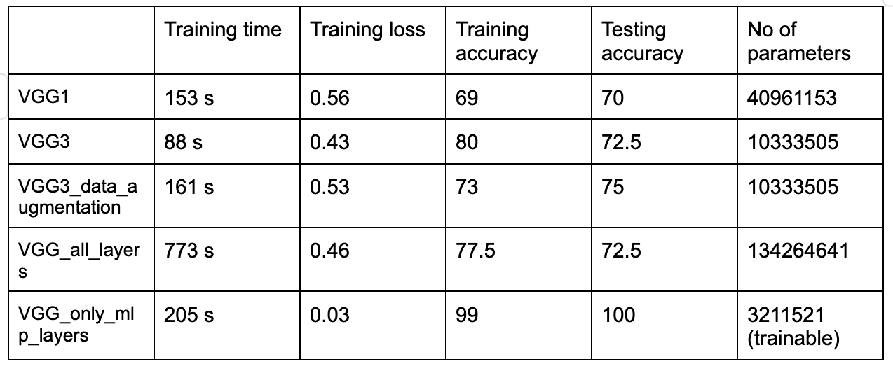

# Binary Image Classification with VGG Variants and Transfer Learning

## Results

VGG1 model is basic model with one conv and one pooling layer. So that model gives accuracy near 70%

When we shift to VGG3 model conv and pooling layers are increased so that learning capabilty of model is increased along with accuracy i.e. 73%

As we keep on increasing the layers in the model we can see that model is classifying with better accuracy. VGG16 model with tuning only mlp layers achieves accuracy of nearly 100%.

## Data Augmentation

Main objectives of data augementaion are 
1. Increasing the size and make variations in data
2. Data augmentation introduces variability and diversity in the training data, helping the model generalize better. And in turn helps to reduce the overfitting. 
3. When a model is trained on limited data, it might memorize the training examples and perform poorly on new, unseen data (overfitting)
4. Improves the model;s overall performance 

So here accuracy of the test data is increasing to 75 in case of data augmentaion. Beacuse of the above mentioned reasons. 

## Number of epochs for fine tuning the model

When we increase the epochs training and testing accuracy is increasing. But after certain point the training accurcy will increase but testing accuracy might deacrease due to overfitting. 

When we increase the number of epochs the test and train accuracy increase till some point and after that the model starts to capture the specific noise present in the dataset which leads to poor generalisation. So we can prevent overfitting by techniques such as data augmentation and early stopping.

## Images that the model is confused about

Some image models (basic ones like VGG1, VGG3) are confused about some images. Because in some images color of rabbit and color of squirrel is matching and due to which models are unable to differentiate between the images. Some images are also little bit unclear because of which also model is giving wrong predictions. 

For models like VGG16 with pretrained weights models is giving very good classification and it is not confused about images. As weights of the VGG16 model are learned on Imagenet like big dataset. So it is classifing out dataset perfectly.

When we use VGG16 with tuning all the layers, the accuracy is near to 72.5% and not 100% which is expected by VGG16 since here we are not using the pre trained weights (which were generated by training on ImageNet dataset). So to achieve a higher accuracy we would need to train the model on a larger dataset and for more number of epochs and stop training when the validation accuracy reaches a particular threshold, i.e. early stopping (to avoid overfitting).

## Comparison: MLP model (with a comparable number of parameters to VGG16)

MLP model is performing better than some basic VGG models like VGG1 and VGG3 because those are pretty basic models with 2-3 conv layers but the MLP model implemented is very deep with comparable number of parameters to VGG16. But When we compare it to VGG16 model with pretrained weights, the VGG16 model outperforms MLP model. As the Convolutional Networks have some properties which makes them better for images like dataset, such as: 

1. Parameter Efficiency: Due to the shared weights and local connectivity in convolutional layers, CNNs require significantly fewer parameters than fully connected networks. 
2. Pooling Layers: CNNs often include pooling layers (such as max pooling or average pooling) that reduce the spatial dimensions of the input and allow the network to focus on the most important features (feature extraction)
3. Spatial Hierarchy: CNNs are designed to take advantage of the spatial hierarchy in images. They apply convolutional layers that use small filters to learn features from local areas of the image. This allows CNNs to detect patterns like edges, textures, and shapes. 

MLP model is giving near to 85% accuracy. And VGG16 pretrained model is giving near to 100% accuracy. VGG16 with tuning all layers is giving 72.5% accuracy. Here our dataset is very small and we have trained VGG16 model only for 10 epoch hence VGG16 is giving less accuracy. But if we train the model long enough and increase the size of the dataset then the VGG16 accuracy will keep on increasing because model will be able to generalie better and extract the features, but MLP model's accuracy would remain roughly the same.

## Table
